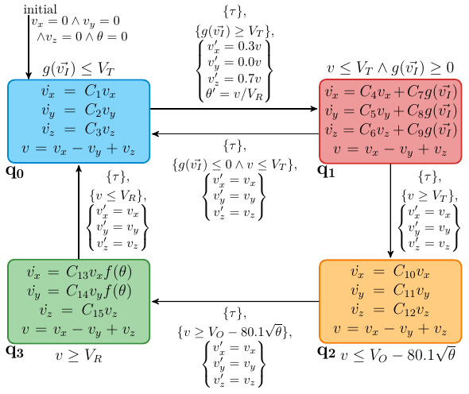
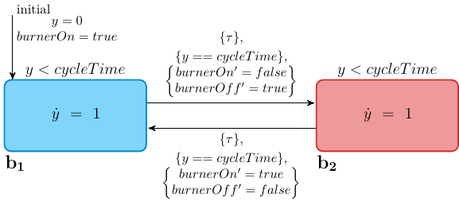

# HAML Benchmarks

This directory stores the benchmarks for Chapter 5 of the thesis.

For each of the benchmarks, we provide a series of files:
- The original [HAML](https://github.com/PRETgroup/modular-code-generation/blob/master/specs/HAML.md) definition for the benchmark can be found in the [haml](haml) folder.
- Pre-generated C code for software execution can be found in the [c](c) folder.
- Pre-generated VHDL code for hardware execution can be found in the [vhdl](vhdl) folder.

*The pre-generated code is created using the [Modular Code Generation](https://github.com/PRETgroup/modular-code-generation) compiler.*

### Thermostat
[HAML file](haml/thermostat.yaml) | [C Code](c/thermostat) | [VHDL Code](vhdl/thermostat)

Simple thermostat which maintains temperature within some bounds.

### Cardiac Cell
[HAML file](haml/cardiac_cell.yaml) | [C Code](c/cardiac_cell) | [VHDL Code](vhdl/cardiac_cell)

Model that captures the electical behaviour of a cardiac cell.

### Train-Gate
[HAML file](haml/train_gate.yaml) | [C Code](c/train_gate) | [VHDL Code](vhdl/train_gate)

The operation of a railroad crossing gate with periodic trains.

### Water Heater
[HAML file](haml/water_heater.yaml) | [C Code](c/water_heater) | [VHDL Code](vhdl/water_heater)

The heating of water in a water tank, along with a burner.

### Nuclear Plant
[HAML file](haml/nuclear_plant.yaml) | [C Code](c/nuclear_plant) | [VHDL Code](vhdl/nuclear_plant)

Controller and plant for the control rods of a nuclear plant.

### Cardiac Grid
[HAML file](haml/cardiac_grid.yaml) | [C Code](c/cardiac_grid) | [VHDL Code](vhdl/cardiac_grid)

A 5 × 5 grid of connected cardiac cells.
